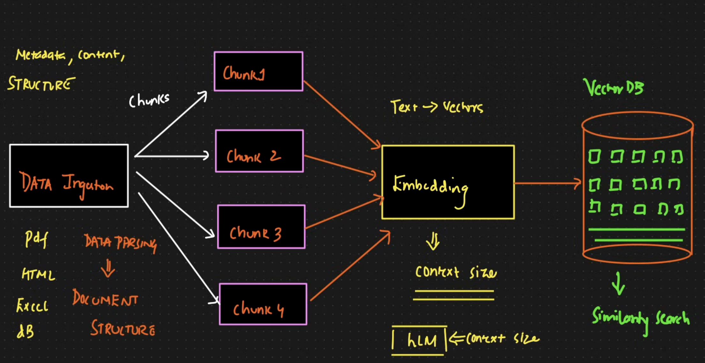

# Agentic AI RAG Workflow

An end-to-end Retrieval-Augmented Generation (RAG) workflow for **data ingestion, indexing, retrieval, and response generation** using an **Agentic AI** approach.

This project is designed to show how documents move through the pipeline:

1. **Data ingestion**
2. **Preprocessing and chunking**
3. **Embedding generation**
4. **Vector storage**
5. **Agent-driven retrieval**
6. **Context-aware answer generation**

## Overview

Traditional RAG systems retrieve relevant chunks and pass them to an LLM for answer generation.  
An **Agentic RAG workflow** goes a step further by allowing an intelligent agent to:

- decide when to retrieve
- choose the right tool or retriever
- refine search queries
- validate retrieved context
- generate better grounded responses

This makes the system more adaptive for complex question-answering and knowledge retrieval tasks.

## Workflow

The complete workflow follows this sequence:

`Raw Data -> Ingestion -> Cleaning -> Chunking -> Embeddings -> Vector Store -> Retriever -> Agent -> LLM Response`

### 1. Data Ingestion

The workflow starts by collecting data from one or more sources such as:

- PDF documents
- text files
- web pages
- internal knowledge bases
- structured or unstructured enterprise content

At this stage, the goal is to load source data into the pipeline in a consistent format.

### 2. Data Preprocessing

Once data is loaded, it is cleaned and normalized. Common preprocessing tasks include:

- removing noisy or irrelevant text
- fixing formatting issues
- extracting useful metadata
- preparing the content for chunking

This step improves retrieval quality and keeps the vector database more meaningful.

### 3. Document Chunking

Large documents are broken into smaller chunks so they can be embedded and retrieved effectively.

Chunking strategies may include:

- fixed-size chunking
- recursive text splitting
- semantic chunking
- metadata-aware chunking

Good chunking is critical because retrieval quality depends heavily on how information is segmented.

### 4. Embedding Generation

Each chunk is converted into a dense vector representation using an embedding model.

These embeddings capture semantic meaning, which allows the system to retrieve relevant content even when exact keywords do not match the user query.

### 5. Vector Store Indexing

The generated embeddings are stored in a vector database for fast similarity search.

Typical responsibilities of this stage:

- store embeddings
- attach metadata
- support similarity-based retrieval
- enable filtering and ranking

### 6. Query Understanding and Retrieval

When a user submits a query, the system:

- interprets the user intent
- converts the query into an embedding
- searches the vector store
- retrieves the most relevant chunks

In an agentic system, this stage can also include query rewriting, multi-step retrieval, or tool selection.

### 7. Agentic Reasoning

The agent acts as the orchestrator of the workflow. Depending on the query, it can:

- decide whether retrieval is needed
- select the best retriever or tool
- re-rank or validate results
- perform iterative search if context is insufficient
- combine retrieved knowledge before generation

This is the core difference between standard RAG and Agentic RAG.

### 8. Response Generation

Finally, the LLM uses the retrieved context to generate a grounded answer.

The response should be:

- relevant to the query
- based on retrieved knowledge
- less prone to hallucination
- traceable to supporting source content

## Architecture Summary

Below is the logical architecture of the system:

- **Data Sources**: PDFs, text files, websites, databases
- **Ingestion Layer**: loaders and parsers
- **Processing Layer**: cleaning, splitting, metadata enrichment
- **Embedding Layer**: text-to-vector conversion
- **Storage Layer**: vector database
- **Retrieval Layer**: similarity search and ranking
- **Agent Layer**: reasoning, tool usage, retrieval decisions
- **Generation Layer**: final LLM-based answer generation

### Data Ingestion Pipeline

### Retrieval and Response Flow

If your image names are different, just replace the file names in the paths above.

## Example Use Case

A user asks a question like:

> "What are the main risks mentioned in the uploaded policy documents?"

The system then:

1. understands the question
2. retrieves relevant chunks from the indexed documents
3. lets the agent decide whether more context is needed
4. passes validated context to the LLM
5. returns a grounded answer

## Why Agentic RAG?

Agentic RAG is useful because it improves:

- retrieval accuracy
- multi-step reasoning
- tool orchestration
- response grounding
- adaptability for complex workflows

It is especially valuable when building intelligent systems for:

- enterprise search
- document Q&A
- research assistants
- customer support automation
- knowledge management systems
